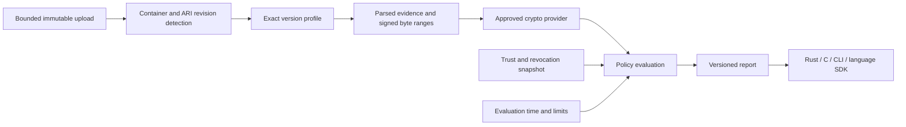

# Architecture

Status: accepted direction; only the pre-spec scaffold exists today.

## Boundaries

`openari-core` owns bounded parsing, format dispatch, signed-byte selection,
cryptographic orchestration, and policy evaluation. It has no implicit network
access, system clock reads, global mutable trust store, or image upload behavior.
`openari-cli` builds the `openari` executable and owns file access and presentation.
`openari-ffi` owns unsafe C interop.
Bindings call the same core rather than reimplementing verification rules.

Independent camera signing and capture-evidence verification are planned in
[open-ari-capture](https://github.com/open-ari/open-ari-capture). Its camera adapters,
signing backends, and private/manufacturer trust roots stay outside this Apple ARI
engine. Future integration may use optional commands in the existing openari CLI;
no capture API or command is implemented here. Never fall back from failed Apple
verification to acceptance under an independent capture profile.

## Planned modules

| Module | Responsibility |
| --- | --- |
| `container` | Bounded JPEG/TIFF traversal; offsets refer to the original input |
| `format` | Exact profile registry; unsupported versions remain unsupported |
| `evidence` | Owned or borrowed immutable evidence with explicit provenance |
| `crypto` | Approved algorithm suites and interchangeable tested implementations |
| `trust` | Explicit anchors and constraints; no reliance on the OS web PKI |
| `policy` | Full decision from evidence, snapshots, limits, and supplied time |
| `inspect` | Forensic data marked untrusted until separately verified |

Start these as modules. Split crates when dependency isolation or consumers
justify it. Do not create unused traits for unspecified Apple data structures.

## Data and ownership

Inspection and verification operate on the same immutable bytes. Keep raw
signed ranges without decode/re-encode transformations. Stream hashing where
the confirmed profile permits it. Bound metadata independently of total file
size. Seekable inputs need stable snapshots; concurrent file changes must not
mix evidence from different objects. Do not trust an extension or MIME header.

The future verifier context owns immutable policy and trust snapshots and is
reused across requests. Network refresh atomically replaces snapshots outside
the verification path. Each request retains the snapshot it started with.

## Dependencies

Current dependencies provide CLI parsing and report serialization only. Select
ASN.1, certificate validation, hashing, and composite-signature implementations
after a profile compatibility spike. Record license, maintenance, audits,
platform support, fuzz history, known advisories, and performance measurements.
Parsing a certificate or checking its signature is not full path validation.

No dynamic loading of arbitrary crypto plugins. Providers are reviewed build
choices, identified in capabilities and reports. Core policy must produce the
same decision with every approved provider.
